# azure-dr-drill

A real disaster-recovery drill on Azure, built and measured the same way as the AWS drill in
[`eks-gitops-dr-drill`](https://github.com/gkoufie1/eks-gitops-dr-drill): targets written down
**before** the drill, a real failover, results published **as measured** (including the miss), and
every mistake recorded instead of smoothed over.

A Linux VM in **West US** was replicated to **Central US** with **Azure Site Recovery (ASR)**, failed
over for real, and timed. The lab infrastructure was built with Terraform (the resource groups, the budget
and the failover calls were done by hand or by REST) on an Azure Free Trial subscription, which turned out to
shape the design more than anything else.

> **Status as of 2026-09-25 (night):** ASR drill 001 is done, **and the lab has been torn down and
> verified empty** (Step 13). The second drill (Azure SQL failover group) has **not** been done
> (Step 14). The real cost figure isn't in yet, because Azure's billing data lags about a day.

## Results at a glance

| | Target (committed before the run) | Measured | Result |
|---|---|---|---|
| **RTO** | 15 minutes | **2 min 34 s** | **Met**, measured from the recovered VM's own log, not the runbook's external health checks (see caveat) |
| **RPO** | 5 minutes | **304 s (5 min 4 s)** | **Missed by 4 seconds** |

Targets were pushed in commit [`64dfe3d`](https://github.com/gkoufie1/azure-dr-drill/commit/64dfe3d) before any failover ran.
The full timeline, the caveats and the likely cause of the RPO miss are in
[`docs/asr-drill-001-results.md`](docs/asr-drill-001-results.md).

## Contents

1. [Goal and approach](#1-goal-and-approach)
2. [Architecture](#2-architecture)
3. [Step 1: Find out what the subscription can actually do](#step-1-find-out-what-the-subscription-can-actually-do)
4. [Step 2: Put a cost guardrail in place](#step-2-put-a-cost-guardrail-in-place)
5. [Step 3: Resource groups](#step-3-resource-groups)
6. [Step 4: The two networks](#step-4-the-two-networks)
7. [Step 5: The VM](#step-5-the-vm)
8. [Step 6: The ASR plumbing](#step-6-the-asr-plumbing)
9. [Step 7: Enable replication (three attempts)](#step-7-enable-replication-three-attempts)
10. [Step 8: Set the targets and build the measuring tool](#step-8-set-the-targets-and-build-the-measuring-tool)
11. [Step 9: Test failover (the rehearsal)](#step-9-test-failover-the-rehearsal)
12. [Step 10: Clean up the test failover](#step-10-clean-up-the-test-failover)
13. [Step 11: The real failover](#step-11-the-real-failover)
14. [Step 12: What the numbers say](#step-12-what-the-numbers-say)
15. [Step 13: Teardown](#step-13-teardown)
16. [Step 14: Azure SQL failover group drill (not started)](#step-14-azure-sql-failover-group-drill-not-started)
17. [Every resource created](#every-resource-created)
18. [Problems hit and how each was solved](#problems-hit-and-how-each-was-solved)
19. [Cost](#cost)
20. [Reproduce it](#reproduce-it)
21. [What this does not show](#what-this-does-not-show)
22. [Repo layout](#repo-layout)

---

## 1. Goal and approach

**Goal:** get hands-on, *measured* Azure disaster-recovery experience: RTO (how long recovery takes)
and RPO (how much data is lost), not just "I read about Site Recovery".

**Approach**, deliberately the same as the AWS project:

1. Find out the real constraints first.
2. Set a cost guardrail before anything billable exists.
3. Build with Terraform so it is reproducible and destroyable.
4. Write the RTO/RPO targets down and commit them **before** running the drill.
5. Run a rehearsal (test failover), then the real failover.
6. Publish what was measured, met or missed, with the cause.
7. Tear down and verify against Azure directly, not just trust a command's exit code.

Two drills were planned: **ASR (VM failover)**, done, and an **Azure SQL failover group**, not started.

## 2. Architecture

```
          West US (source)                                Central US (recovery)
 ┌───────────────────────────────────┐            ┌───────────────────────────────────────┐
 │ rg-dr-drill-westus                 │            │ rg-dr-drill-centralus                  │
 │                                    │            │                                        │
 │  vnet-drdrill-source  10.10.0.0/16 │            │  vnet-drdrill-target   10.20.0.0/16    │
 │   └ snet-app + NSG (deny inbound)  │            │   └ snet-app + NSG (deny inbound)      │
 │                                    │    ASR     │                                        │
 │  vm-drdrill-web  (D2als_v7)        │ ─────────► │  rsv-drdrill-target  (Recovery Services│
 │   ├ nic + Standard public IP       │ continuous │   vault: fabrics, containers, policy,  │
 │   └ OS disk                        │ replication│   mappings)                            │
 │  stdrdrill…  (ASR cache storage)   │            │  osdisk-drdrill-web-ASRReplica         │
 │                                    │            │  (after failover: recovered VM + NIC   │
 └───────────────────────────────────┘            │   + disk)                              │
                                                    └───────────────────────────────────────┘
```

**Why West US ↔ Central US:** it is the only region pair where *both* a usable VM size *and* Azure SQL
can be created on this subscription (Step 1). It is **not** a Microsoft-paired combination (West US pairs
with East US; Central US pairs with East US 2), so this repo calls it a geo-separated pair, never a
"paired region" pair.

---

## Step 1: Find out what the subscription can actually do

**What:** before writing any Terraform, query the live subscription with the Azure CLI: login state,
resource-provider registration, vCPU quotas, which VM sizes are creatable in which regions, which regions
allow Azure SQL, and the subscription's offer type.

**Why:** the obvious plan (East US ↔ West US, a cheap old VM size) would have failed. Checking first turned
three separate surprises into design inputs instead of mid-build failures.

**What it found:**

| Finding | Consequence |
|---|---|
| The subscription is a **Free Trial** with the **spending limit on** | It cannot run up a real bill, but it has hard restrictions (below) and a deadline |
| **4 vCPU quota per region** | Two 2-vCPU VMs fit exactly; a test-failover VM has to be cleaned up before the real one |
| Older VM sizes (B1s, B2s, D2s_v3, DS1_v2 and similar) are `NotAvailableForSubscription` in East US, West US, East US 2 and Central US | Only newer v6/v7 sizes are usable. (An early read of mine said *all* sizes were blocked; that was wrong, I had only tested the old ones.) |
| **Azure SQL provisioning is blocked** in East US, East US 2, North Central, South Central, West US 2 | Available only in West US, West US 3 and Central US |
| All resource providers needed were already registered | No provider registration step needed |

**Decision:** West US ↔ Central US, VM size chosen from what is unrestricted in both.

**How:** `az account show`, `az provider show`, `az vm list-usage`, `az vm list-skus`, and the
`Microsoft.Sql/locations/.../capabilities` API. No screenshots: this step is CLI-only.

---

## Step 2: Put a cost guardrail in place

**What:** a **$10/month Azure budget** (`monthly-cap-10usd`) with email alerts at **50%, 80% and 100%** of
actual spend, created through the `Microsoft.Consumption` budgets API.

**Why:** the rule for this project (from the AWS one) is that a cost guardrail exists *before* anything
billable. The trial's spending limit is a second, independent safety net. The alert address is set in the
budget itself and is deliberately not in this repo.

**How:** `az rest --method put` against `.../providers/Microsoft.Consumption/budgets/monthly-cap-10usd`.
No screenshot; it lives in the portal under *Cost Management → Budgets*.

---

## Step 3: Resource groups

**What:** two resource groups, one per region, tagged `Project=azure-dr-drill`, `Environment=dev`,
`ManagedBy=terraform`:

| Resource group | Region |
|---|---|
| `rg-dr-drill-westus` | West US |
| `rg-dr-drill-centralus` | Central US |

**Why:** one group per region keeps each side's resources together, makes teardown unambiguous, and keeps
this project away from the subscription's older groups (which were left untouched).

**A mistake worth recording:** the West US group was first created in **West US 2**, because I never specified
the region. Azure SQL is blocked in West US 2, so that would have been misleading for a project built
around West US. It was empty, so it was deleted and recreated in `westus`. The resource group screenshots
appear in Steps 5 and 6, once the groups have resources in them.

---

## Step 4: The two networks

**What:** Terraform (`network.tf`) created, for each region, a virtual network, one subnet
(`snet-app`) and a network security group (NSG) attached to that subnet.

| | Source (West US) | Target (Central US) |
|---|---|---|
| VNet | `vnet-drdrill-source`, `10.10.0.0/16` | `vnet-drdrill-target`, `10.20.0.0/16` |
| Subnet | `snet-app`, `10.10.1.0/24` | `snet-app`, `10.20.1.0/24` |
| NSG | `nsg-drdrill-source` | `nsg-drdrill-target` |

**Why:**
- **Non-overlapping address spaces** (10.10 vs 10.20) are what a real DR network looks like, and they keep a
  later peering or VPN possible.
- **The NSGs have no custom rules on purpose.** Azure's default rules deny all inbound traffic from the
  internet, and nothing in this lab needs to be reachable from outside.
- ASR needs a **network mapping** between source and target (Step 6), so both networks must exist first.

**Screenshots:**

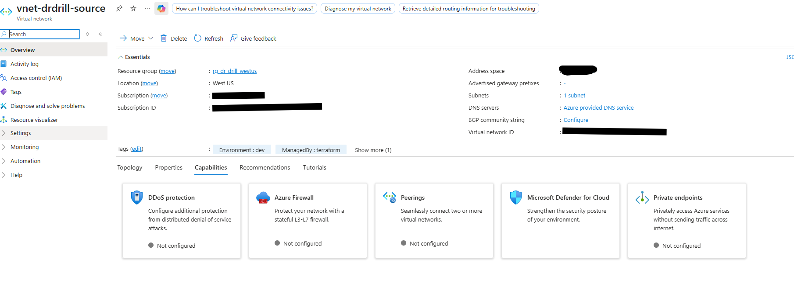
*The source VNet in `rg-dr-drill-westus`, tagged `ManagedBy: terraform`. Address space and IDs are redacted.*

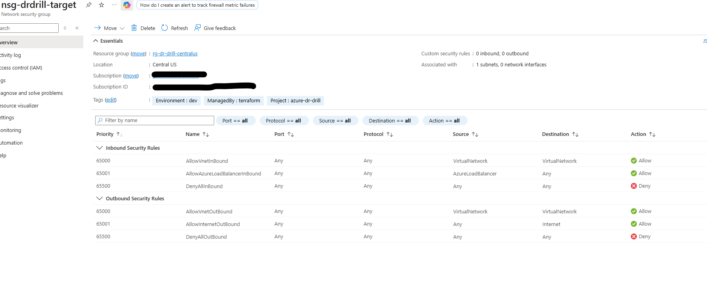
*The target NSG: **0 custom inbound, 0 custom outbound rules**, associated with 1 subnet. Only Azure's default rules apply, including `DenyAllInBound`.*

---

## Step 5: The VM

**What:** Terraform (`compute.tf`) created a public IP, a network interface and one Linux VM in West US:

| Setting | Value | Why |
|---|---|---|
| Size | `Standard_D2als_v7` (2 vCPU, 4 GiB) | Cheapest of the eight 2-vCPU sizes open in *both* regions: **$0.094/h** vs **$0.213/h** for the `D2ds_v7` first planned (published West US Linux prices) |
| OS | Ubuntu 24.04 LTS, Gen2 | ASR supports NVMe disk controllers only with certain OSes; 22.04 is not one of them (Step 7) |
| Auth | SSH key only, password auth disabled | No secrets; only the public key is referenced |
| OS disk | Standard SSD, explicitly named `osdisk-drdrill-web` | The name lets ASR's disk mapping look it up |
| Public IP | Standard SKU, static | An *explicit outbound path*. ASR's agent needs to reach Azure endpoints, and Azure is retiring default outbound access. Inbound is still denied by the NSG |
| Updates | Automatic updates off (cloud-init) | So the kernel cannot drift past what ASR supports (Step 7) |

**Screenshots:**

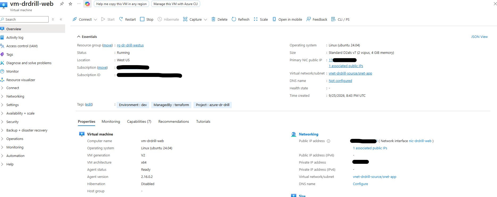
*`vm-drdrill-web`: Running, West US, `Standard D2als v7`, Ubuntu 24.04, created 2026-09-25 20:43 UTC. The portal doesn't show the running kernel.*

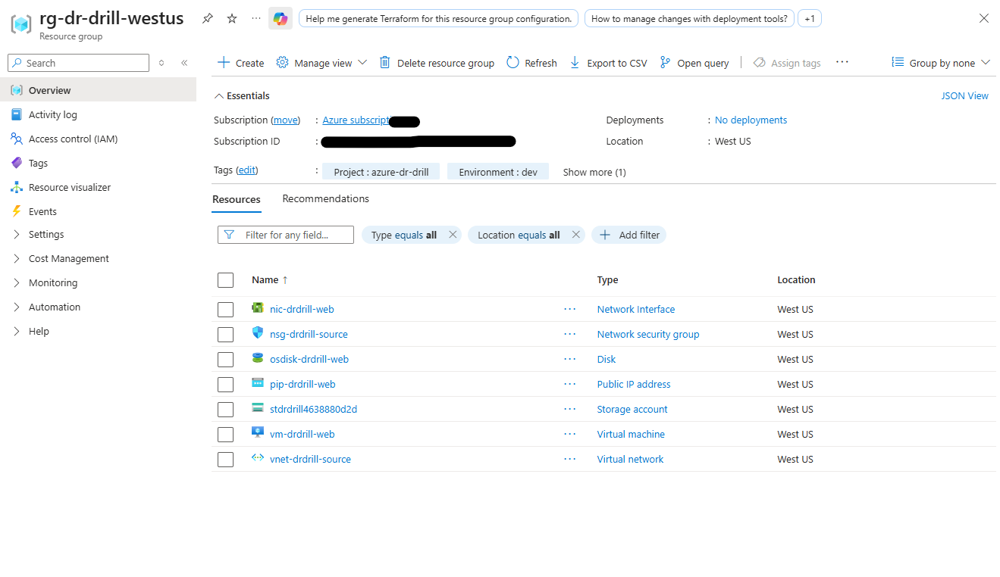
*Everything in the West US group: NIC, NSG, OS disk, public IP, the ASR cache storage account, the VM and the VNet.*

---

## Step 6: The ASR plumbing

**What:** Terraform (`asr.tf`) built the Site Recovery structure. Each piece has one job:

| Resource | Where | Why it exists |
|---|---|---|
| **Recovery Services vault** `rsv-drdrill-target` | **Central US** | The vault must live in the *target* region so it survives a failure of the source region |
| **Fabric** `fabric-primary` / `fabric-secondary` | inside the vault | ASR's model of "the source region" and "the target region" |
| **Protection container** `container-primary` / `-secondary` | inside the vault | Groups replicated items within each fabric |
| **Replication policy** `policy-24h-retention` | inside the vault | 24 h of recovery points, an app-consistent snapshot every 4 h. These numbers bound the RPO the lab can honestly claim |
| **Container mapping** | inside the vault | Pairs the primary and secondary containers under that policy |
| **Network mapping** | inside the vault | Tells ASR that `vnet-drdrill-source` maps to `vnet-drdrill-target` for recovered VMs |
| **Cache storage account** `stdrdrill…` | **West US** (source) | ASR stages replication data in a storage account in the *source* region before shipping it |

**A design note:** the vault's soft delete could not be turned off. An earlier draft tried to disable it to
make teardown easier; the provider rejected that ("a required security feature and cannot be disabled").
The code comment was corrected rather than left claiming otherwise. It only affects Azure Backup items, not
ASR replicated items.

**Screenshots:**

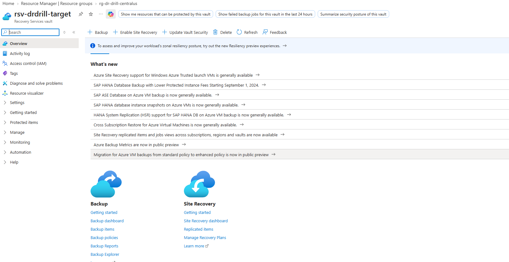
*The Recovery Services vault landing page, with Backup and Site Recovery entry points.*

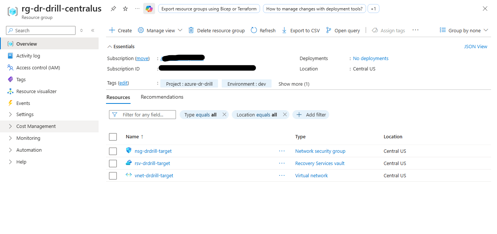
*The recovery side before replication succeeded: just the vault, VNet and NSG.*

---

## Step 7: Enable replication (three attempts)

This step was meant to be a formality and became the most educational part. A one-VM **canary** existed to
answer "will ASR accept this VM?" before building more. It took three tries, and each error was different.

| # | Result | Error | Root cause | Fix |
|---|---|---|---|---|
| 1 | Failed in 2 s | **151273** | The v7 sizes use an **NVMe** disk controller, and ASR only supports NVMe with **RHEL 9.x, Ubuntu 24.04 or SLES 15 SP4-SP7**. The VM ran Ubuntu 22.04 | Moved to Ubuntu 24.04. (A SCSI-controller fallback was ruled out: `D2als_v7` reports NVMe only.) |
| 2 | Failed in about 6 min | **151141** | The OS check now passed, but ASR rejected the **kernel**. The Mobility agent build this vault installs (**9.67.7789.1**, published 2026-05-04) supports Ubuntu 24.04 kernels only up to **6.14.0-1017**, while the image ran **6.17** | Installed the supported 6.14.0-1017 kernel, made GRUB boot it, and disabled automatic updates. An older marketplace image did **not** help: even the April 2026 image already ran 6.17 |
| 3 | **Succeeded** | none | The second attempt had left a dead replication record in `EnablingFailed` state, which made the retry fail with "already exists" | Removed the record with ASR's disable-replication call, then applied cleanly |

**How the kernel problem was actually diagnosed:** ASR keeps an exact per-kernel support list per agent
build in the public `Azure/Azure-SiteRecovery` GitHub repo. Comparing agent builds showed the first one that
lists kernel 6.17.0-1022 is 9.67.7893.1 (2026-08-13), which this vault was not installing. Reading the
vault's actual agent version (**9.67.7789.1**) is visible in the screenshot below.

**Screenshots:**

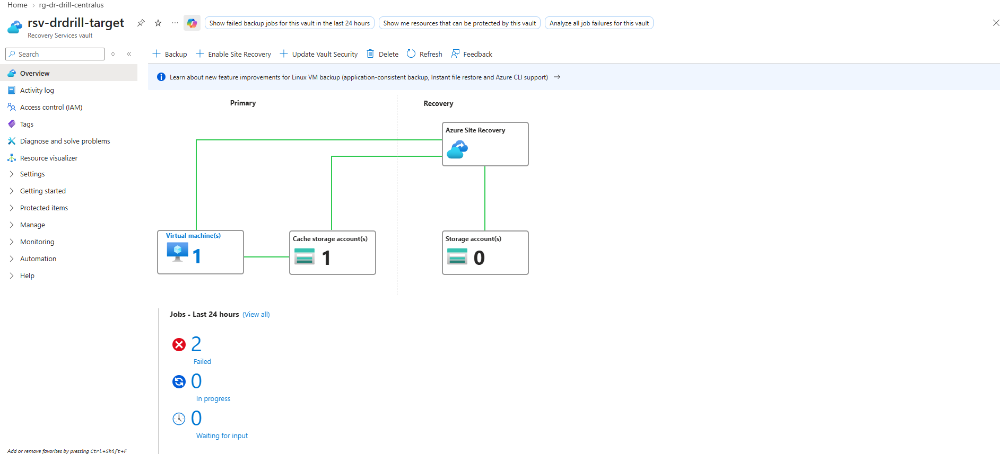
*The vault after the two failed attempts: **2 failed jobs** in the last 24 hours. The tile counts only failed, in-progress and waiting jobs, so the later success doesn't appear on it.*

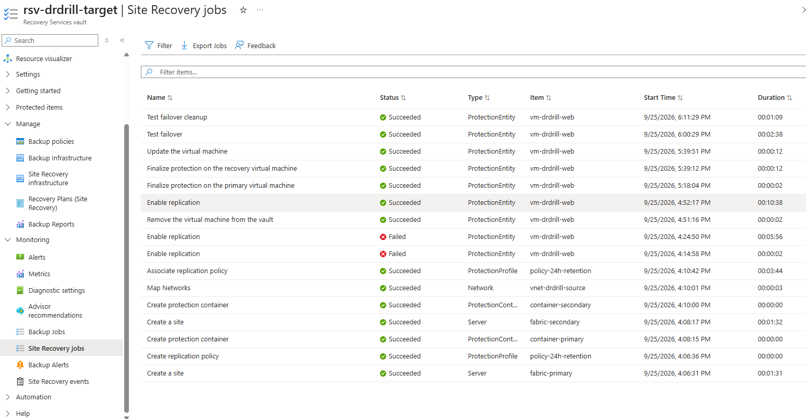
*The whole story in one table (portal times are Eastern, UTC−4): **Enable replication** Failed at 4:14 PM (2 s), Failed at 4:24 PM (5 min 56 s), **Succeeded at 4:52 PM (10 min 38 s)**, with the "Remove the virtual machine from the vault" cleanup between them. Below that, the Test failover (2:38) and its cleanup (1:09) from Steps 9 and 10.*

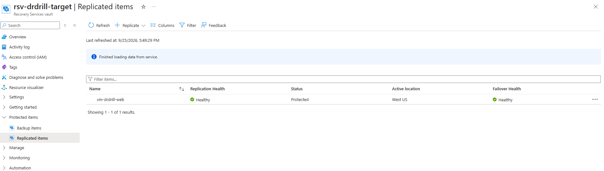
*The result: `vm-drdrill-web` is **Protected**, replication **Healthy**, failover health **Healthy**, active location West US.*

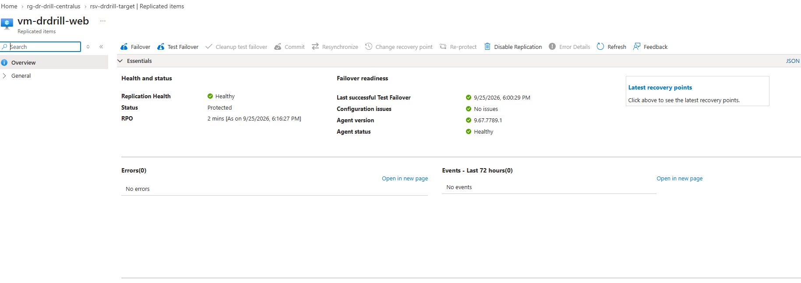
*Failover readiness: **RPO 2 mins**, a successful test failover, no configuration issues, and **agent version 9.67.7789.1**, the build behind the kernel problem.*

**Honest limit:** the kernel pin is written into the Terraform (cloud-init in `compute.tf`, variable
`pinned_kernel`) but the *live* canary VM was patched by hand with a run-command script while debugging.
The cloud-init version has **not yet been exercised on a fresh build.**

---

## Step 8: Set the targets and build the measuring tool

**What, in this order:**

1. **Write the targets and commit them first:** RTO 15 minutes, RPO 5 minutes, in
   [`docs/runbooks/asr-drill.md`](docs/runbooks/asr-drill.md), commit `64dfe3d`, before any failover ran.
2. **Install a heartbeat on the VM:** a small systemd service that appends a UTC timestamp to
   `/var/log/heartbeat.log` every second and flushes it to disk.
3. **Run pre-flight checks:** replication Protected and Healthy, current RPO, newest recovery points, source VM
   running, heartbeat active.

**Why:**
- **Targets first**, so the commit timestamp is evidence they were not chosen after seeing results.
- **The heartbeat makes both numbers measurable instead of estimated.** After a failover, the newest heartbeat
  on the recovered VM shows exactly how much of the write stream survived (RPO), and the first *fresh*
  heartbeat shows the moment the workload was running again (RTO).
- It is a synthetic workload. That is its limit, and Step 12 states it.

**How the two numbers are defined** (from the runbook):
- **RTO:** failover trigger → the workload is running on the recovered VM.
- **RPO:** the time the source was stopped minus the newest heartbeat found on the recovered VM.

No screenshot: this step is CLI and repo only.

---

## Step 9: Test failover (the rehearsal)

**What:** ASR's non-disruptive test failover: it builds a copy of the VM in the recovery region from a recovery
point, leaving the source untouched.

**Why:** it is how a real team validates DR without an outage, and it proved the recovery side worked before
the real one. It also produced a baseline: the recovered VM booted the replicated 6.14 kernel with the heartbeat
service running, so the heartbeat unit, the kernel pin and the replicated disk all crossed the region.

**How:** a REST call (`POST .../replicationProtectedItems/<item>/testFailover`) with a body naming the
recovery network and an explicit recovery point:

```json
{ "properties": {
    "failoverDirection": "PrimaryToRecovery",
    "networkType": "VmNetworkAsInput",
    "networkId": "<resource id of vnet-drdrill-target>",
    "providerSpecificDetails": { "instanceType": "A2A", "recoveryPointId": "<newest recovery point id>" } } }
```

**Result:** the job took **2 min 38 s** (see the Test failover row in the jobs screenshot above); the first fresh
heartbeat on the recovered VM appeared **157 s** after the trigger.

**Screenshot:**

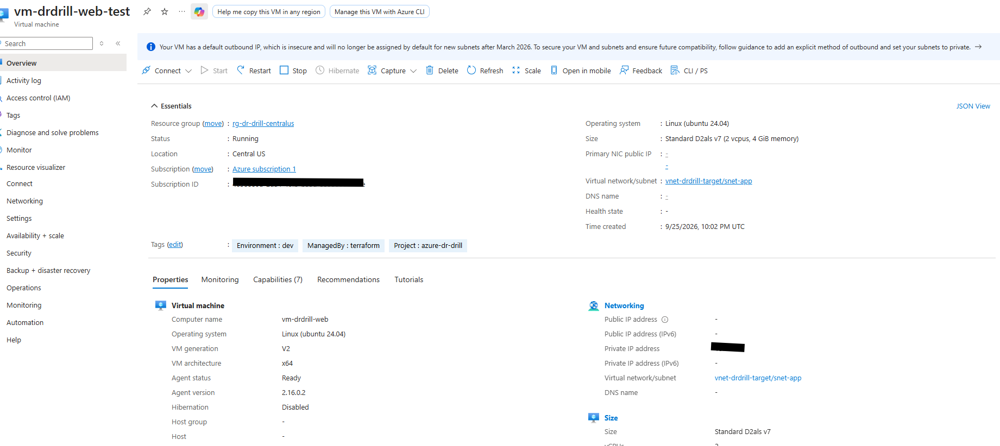
*`vm-drdrill-web-test`: Running in Central US on `vnet-drdrill-target/snet-app`, created 22:02 UTC, computer name `vm-drdrill-web`. The portal's banner about a default outbound IP is Azure's advice: the recovery side has no explicit outbound method, a gap the results note.*

**Not the drill's RPO:** this test deliberately used an older recovery point (21:54:09), so its heartbeat gap
of 533 s (376 s of stale data plus 157 s of failover) says nothing about the real drill.

---

## Step 10: Clean up the test failover

**What:** ASR's test-failover cleanup, which deletes the test VM, NIC and disk.

**Why:** a test failover must be cleaned up before a real failover, and the region's 4-vCPU quota only has room
for one recovered VM at a time.

**How:** `POST .../testFailoverCleanup`. The job took **1 min 09 s**, and the result was verified against Azure
directly (a resource list of the group), not just from the job status.

**Screenshot:**

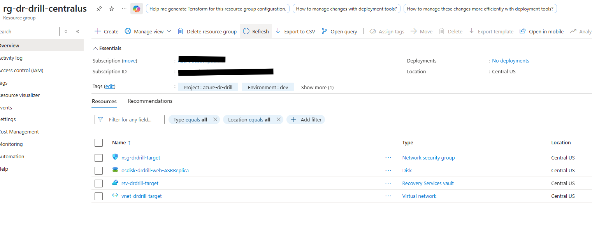
*Four resources, not three: `osdisk-drdrill-web-ASRReplica` is the **replica disk** ASR created when replication reached Protected. It is meant to be there and is not a leftover from the test.*

---

## Step 11: The real failover

**What, in order:**

1. **Simulate the outage:** `az vm deallocate` on the source VM. The moment the command was issued is the
   recorded stop time (22:34:13 UTC).
2. **Trigger an unplanned failover** with recovery point type **"Latest"** (22:34:46 UTC).
3. **Measure** recovery and data loss from the recovered VM's heartbeat log.

**Why:** stopping the source first simulates a real outage. "Latest" is the lowest-RPO option ASR offers.

**How:**

```json
{ "properties": {
    "failoverDirection": "PrimaryToRecovery",
    "sourceSiteOperations": "NotRequired",
    "providerSpecificDetails": { "instanceType": "A2A", "recoveryPointType": "Latest" } } }
```

**Screenshots:**

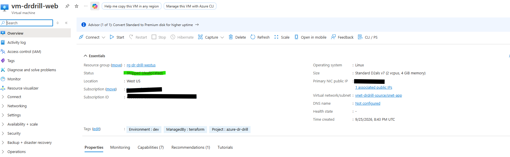
*The source VM `vm-drdrill-web` in West US: **Stopped (deallocated)**. This is the simulated outage.*

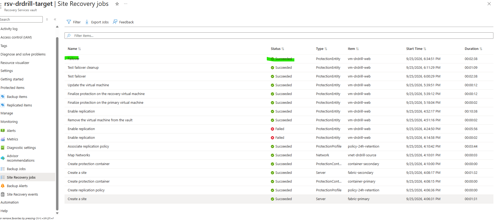
*The **Failover** job at the top: Succeeded, started 6:34:51 PM Eastern, duration **2:38**.*

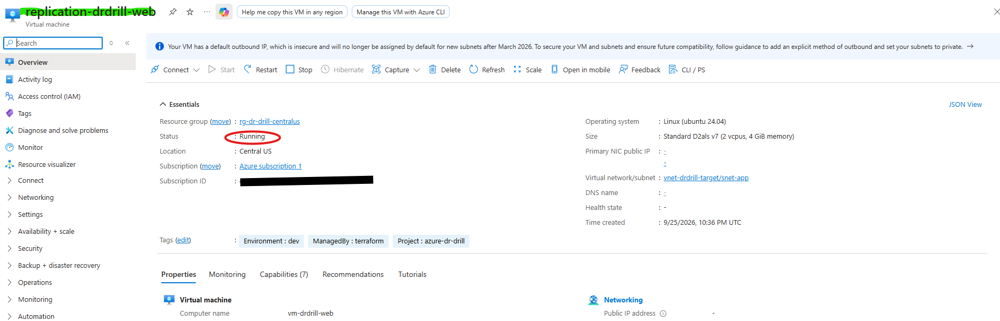
*The recovered VM, **`replication-drdrill-web`** (ASR named it after the replication item), Running in Central US, created 22:36 UTC, computer name `vm-drdrill-web`.*

---

## Step 12: What the numbers say

| | Target | Measured | Result |
|---|---|---|---|
| RTO | 15 min | 153.7 s (2 min 34 s) | **Met** |
| RPO | 5 min | 304.0 s (5 min 4 s) | **Missed by ≥ 4 s** |

**Two things must travel with these numbers:**

- **The RTO was not measured the way the runbook defined it.** The runbook called for "3 consecutive external
  health checks". My monitoring script polled a *guessed* VM name (`vm-drdrill-web`), but the recovered VM is named
  `replication-drdrill-web`, so those checks never ran. The 153.7 s comes from the recovered VM's own log (first
  fresh heartbeat, 22:37:20). By the test failover's lag, the runbook-definition number would be roughly
  3.5 to 4 minutes, still well inside 15. That is an estimate, not a measurement.
- **The RPO miss is real.** The recovered data ended at the 22:29:10 recovery point, five minutes old, although ASR
  reported an RPO of about two minutes just before the stop. The failover job's steps show *"Synchronizing the
  latest changes"* did not run; the likely cause is that I set the source-shutdown option to `NotRequired`. That is
  a **hypothesis, not yet tested.**

Timeline, derivation, all caveats and the per-step timings are in
[`docs/asr-drill-001-results.md`](docs/asr-drill-001-results.md).

---

## Step 13: Teardown

**Status:** **done and verified, 2026-09-25, about 10 minutes** (23:22 to 23:33 UTC). It did not go to plan on
the first try; that is recorded below.

**What was done, and why each part:**

1. **Snapshot first,** then a `terraform plan -destroy` (**0 to add, 0 to change, 21 to destroy**), so the
   destroy was reviewed before it ran.
2. **Delete the recovered VM, NIC and disk by hand.** ASR's failover created them, so Terraform's state does not
   know them and `terraform destroy` would never remove them.
3. **`terraform destroy`.** The NSG associations and both NSGs went cleanly. Then it **failed** on the replication record:

   > **Error 150144:** the source VM is `deallocated`. *"Disable replication requires action within the VM,
   > which thus requires the VM to be in 'running' power status."*

   ASR has to remove its agent from *inside* the source VM, so **the source VM must be running to disable
   replication.** I had deallocated it to simulate the outage in Step 11. **Fix:** start the source VM, wait for
   its agent to be Ready, re-plan (**17 left to destroy**, exactly as expected), and destroy again.
4. **Verify against Azure directly,** not the command's exit code:

| Check | Result |
|---|---|
| Resources in `rg-dr-drill-westus` and `rg-dr-drill-centralus` | **0 and 0** |
| Resources tagged `Project=azure-dr-drill`, anywhere | **none** |
| VMs, disks, public IPs, NICs, subscription-wide | **0, 0, 0, 0** |
| The vault, by direct request | **Not Found** |
| Terraform state | **empty** |

**One false alarm, worth knowing about:** right after the destroy, `az resource list` still showed the vault, even
though Terraform said it was gone. A direct request for the vault returned *Not Found*: the list index lags behind
deletions. Trust the direct request, and re-check the list a minute later.

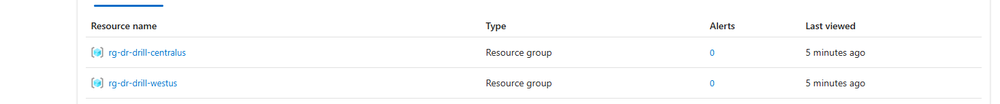

**What was deliberately kept:** the two **empty** resource groups (free; the Azure SQL drill would reuse them) and
the **$10 budget** with its alerts (also free, and it is the guardrail).

**Left behind by Azure itself:** `NetworkWatcherRG` holds a Network Watcher per region. Azure creates these
automatically when a virtual network exists, and two of them appeared because of this project's VNets. They are
free, and they are not deleted here.

**Still to do:** capture the **cost screenshot the day after** (Cost Management → Cost analysis). Azure's cost data
lags about a day, so the real cost is not in this README yet.

---

## Step 14: Azure SQL failover group drill (not started)

The second planned drill: two Azure SQL servers with a **failover group**, live traffic writing timestamped rows,
a forced failover, and both RTO **and RPO** measured (the AWS drill measured RTO only). It is available in
West US and Central US on this subscription, which is one reason those regions were chosen.
**No SQL resources exist and no results are claimed.**

---

## Every resource created

> **All of the resources below were deleted on 2026-09-25 (Step 13) and verified gone.** They are listed as a
> record of what was built and why.

**By Terraform, 21 resources (all in `terraform/asr-lab`):**

| # | Resource | Name | Region | Purpose |
|---|---|---|---|---|
| 1 | Virtual network | `vnet-drdrill-source` | West US | Source network (`10.10.0.0/16`) |
| 2 | Subnet | `snet-app` | West US | Where the VM lives |
| 3 | NSG | `nsg-drdrill-source` | West US | Default-deny inbound |
| 4 | NSG association | source subnet ↔ NSG | West US | Applies the NSG |
| 5 | Virtual network | `vnet-drdrill-target` | Central US | Recovery network (`10.20.0.0/16`) |
| 6 | Subnet | `snet-app` | Central US | Where recovered VMs land |
| 7 | NSG | `nsg-drdrill-target` | Central US | Default-deny inbound |
| 8 | NSG association | target subnet ↔ NSG | Central US | Applies the NSG |
| 9 | Public IP | `pip-drdrill-web` | West US | Explicit outbound path (Standard, static) |
| 10 | Network interface | `nic-drdrill-web` | West US | Connects the VM |
| 11 | Linux VM | `vm-drdrill-web` | West US | The protected workload (also creates `osdisk-drdrill-web`) |
| 12 | Recovery Services vault | `rsv-drdrill-target` | Central US | Holds ASR state; target region by design |
| 13 | ASR fabric | `fabric-primary` | vault | Source region in ASR's model |
| 14 | ASR fabric | `fabric-secondary` | vault | Target region in ASR's model |
| 15 | Protection container | `container-primary` | vault | Groups the source-side items |
| 16 | Protection container | `container-secondary` | vault | Groups the target-side items |
| 17 | Replication policy | `policy-24h-retention` | vault | 24 h retention, 4 h app-consistent snapshots |
| 18 | Container mapping | `container-mapping` | vault | Pairs the containers under the policy |
| 19 | Network mapping | `network-mapping` | vault | Source VNet → target VNet |
| 20 | Storage account | `stdrdrill…` (first 10 chars of the sub ID) | West US | ASR's replication cache |
| 21 | Replicated item | `replication-drdrill-web` | vault | The VM's protection record |

**Created by ASR, not by Terraform:**

| Resource | Where | Why |
|---|---|---|
| `osdisk-drdrill-web-ASRReplica` | Central US | The continuously updated replica of the OS disk |
| Test-failover VM `vm-drdrill-web-test` + NIC + disk | Central US | Step 9. **Deleted in Step 10** |
| Recovered VM `replication-drdrill-web` + NIC + disk | Central US | Step 11. **Deleted by hand in Step 13** |

**Created by hand / CLI:**

| Resource | Why |
|---|---|
| `rg-dr-drill-westus`, `rg-dr-drill-centralus` | Step 3 |
| Budget `monthly-cap-10usd` (subscription level) | Step 2 |
| `heartbeat.service` and `/usr/local/bin/heartbeat.sh` on the VM | Step 8 |
| Kernel `6.14.0-1017-azure` installed and set as the GRUB default on the VM | Step 7, applied by hand to the live canary |

**Deliberately not touched:** the subscription's older resource groups (`DevSevOps`, `rg-cloudapiworkflow`) and
their contents.

---

## Problems hit and how each was solved

| Problem | Root cause | Fix / lesson |
|---|---|---|
| West US resource group created in West US 2 | I never specified a region | Empty, so recreated in `westus`; be explicit |
| "No VM sizes available" (my own overstatement) | I had only tested older sizes | Newer v6/v7 sizes are open; check broadly before concluding |
| Azure SQL blocked in the obvious regions | Free Trial region restrictions | Checked SQL capabilities per region up front; chose West US ↔ Central US |
| Vault soft delete can't be disabled | Azure "secure by default" | Removed the setting and corrected the comment that claimed it was needed |
| Cost estimate too low (15–20¢/h) | I estimated from memory | Looked up published prices; VM alone was 21.3¢; switched to a size at 9.4¢ |
| **ASR error 151273** | NVMe disk controller + Ubuntu 22.04 | Ubuntu 24.04 |
| **ASR error 151141** | Agent build 9.67.7789.1 doesn't know kernel 6.17 | Pinned kernel 6.14.0-1017; an older image did *not* help |
| Retry failed: "already exists" | Failed attempt left an `EnablingFailed` record | Disabled replication on the record, re-applied |
| A SCSI-controller fallback I offered didn't exist | `D2als_v7` is NVMe-only | Verified `DiskControllerTypes` instead of assuming |
| Recovered VM "not found" for 15 minutes | Script assumed the VM's name | ASR names it after the replication item; look it up, don't guess |
| Screenshot instructions gave the wrong VM name | Same wrong assumption | Corrected mid-drill; noted in the results |
| **RPO missed by 4 s** | Recovery point 5 min old; latest-changes sync step skipped | Hypothesis: source shutdown `Required`; untested |
| **Teardown failed: ASR error 150144** | Disabling replication needs the *source* VM running (ASR removes its agent from inside it); I had left it deallocated after the drill | Start the source VM, wait for the agent, re-plan and destroy again. Add "start the source VM" to any future teardown |
| The vault still listed after it was deleted | Azure's resource list index lags behind deletions | A direct request returned *Not Found*; verify with a direct request, not the list |

---

## Cost

**Published prices used for planning** (West US, Linux, pay-as-you-go):

| Item | Rate |
|---|---|
| `Standard_D2als_v7` VM | $0.0944 / hour |
| Standard static public IP | $0.005 / hour |
| ASR, VM replicated to Azure | $25 / month per protected VM (a free first 31 days has been offered; not confirmed here) |

**Guardrails:** the $10/month budget alerts at 50/80/100%, and the trial's spending limit means the subscription
cannot be billed for real. Cost is estimated from those rates against runtimes, not from Azure's billing data,
which lags about a day. The real figure will be added here after teardown.

---

## Reproduce it

Prerequisites: Terraform ≥ 1.6, the Azure CLI (logged in), an SSH public key.

```bash
git clone https://github.com/gkoufie1/azure-dr-drill && cd azure-dr-drill/terraform/asr-lab
cp terraform.tfvars.example terraform.tfvars      # put your subscription id in; the file is gitignored
terraform init
terraform plan -out=tfplan                         # review it: 21 resources to add
terraform apply tfplan
```

Expect these, all documented above: your subscription may restrict different VM sizes and regions (check
Step 1 first); ASR's agent may not support the newest Ubuntu kernel (check the supported-kernel list in
`Azure/Azure-SiteRecovery`); and enabling replication is slow (about 10 minutes for the enable job plus the
initial copy). The failover calls are REST requests shown in Steps 9 and 11.

Local state is used on purpose: this is a single-operator lab torn down after each session.

**Tearing down:** delete anything ASR created by hand first (a recovered VM, its NIC and disk), **make sure the
source VM is running** (ASR cannot disable replication on a deallocated VM, Step 13), then
`terraform plan -destroy` and `terraform destroy`, and verify with direct requests.

---

## What this does not show

- **One drill, one VM, one run.** It shows the mechanism works and roughly how fast, not a benchmark.
- **A synthetic workload.** A heartbeat file is not an application, and crash-consistent recovery points are not
  application-consistent ones.
- **The RTO was measured from the VM's log,** not by the runbook's external health checks (Step 12).
- **The RPO target was missed,** and the cause is a hypothesis, not a finding.
- **The cloud-init kernel pin is untested on a fresh build.**
- **No Azure SQL results exist yet.**
- **The real cost is not in yet.** The figures above are estimates from published prices; Azure's billing data lags
  about a day.
- **The recovery side has no explicit outbound path,** which a production DR design would add.

---

## Repo layout

```
azure-dr-drill/
├── README.md                          you are here
├── terraform/asr-lab/                 the 21 resources (network.tf, compute.tf, asr.tf, variables.tf, outputs.tf)
├── docs/
│   ├── asr-drill-001-results.md       timeline, derivation, caveats, cause analysis
│   └── runbooks/asr-drill.md          the procedure and the pre-committed RTO/RPO targets, plus post-drill notes
└── screenshots/                       the images used above, IDs and IPs redacted
```

**Known residual in the screenshots:** the cache storage account is named `stdrdrill4638880d2d`, which contains
the first 10 characters of the subscription ID. It was reviewed and accepted; later builds should derive the
name from a hash instead.
